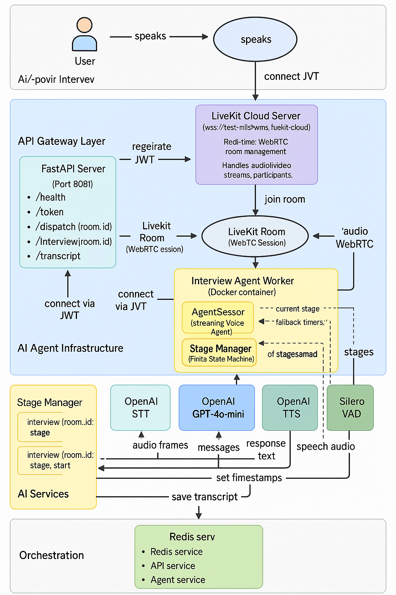

# AI Mock Interview - Multi-Agent System



A production-ready AI mock interview system using LiveKit Agents SDK, featuring multi-stage orchestration, time-based fallbacks, and smooth agent transitions.

## ✨ Features

- **Multi-Stage Interview**: Self-introduction and Past Experience stages
- **Smooth Transitions**: Automatic stage switching with time-based fallbacks
- **OpenAI Integration**: Uses GPT-4o-mini for intelligent responses
- **Redis State Management**: Centralized state store for multi-agent coordination
- **FastAPI REST API**: Enterprise-grade endpoints for session management
- **LiveKit Real-time Audio**: Professional audio pipeline with VAD, ASR, and TTS
- **Docker Support**: Easy deployment with docker-compose

## 🏗️ Architecture

```
                        ┌────────────────────────────┐
                        │        User Audio          │
                        └──────────────┬─────────────┘
                                       │
                        ┌──────────────▼─────────────┐
                        │    LiveKit Room (RTC)       │
                        └──────────────┬─────────────┘
                                       │
                        ┌──────────────▼─────────────┐
                        │   Interview Agent          │
                        │   (Unified Voice Agent)    │
                        └──────────────┬─────────────┘
                                       │
        ┌──────────────────────────────┼──────────────────────────┐
        │                              │                          │
┌──────▼───────┐                ┌──────▼─────────┐        ┌──────▼───────────┐
│ Self-Intro    │                │ Experience      │        │ Stage Manager     │
│ Stage Logic   │                │ Stage Logic     │        │ (FSM + Redis)     │
└──────────────┘                └─────────────────┘        └───────────────────┘
```

## 📋 Prerequisites

- Python 3.10+
- Docker and Docker Compose
- LiveKit Server (Cloud or Self-hosted)
- Redis (included in docker-compose)
- OpenAI API Key

## 🚀 Quick Start

### 1. Set Up Environment Variables

```bash
cp env.example .env
```

Edit `.env` with your credentials:

```env
LIVEKIT_URL=https://your-livekit-server.com
LIVEKIT_API_KEY=your-api-key
LIVEKIT_API_SECRET=your-api-secret
LIVEKIT_WS_URL=wss://your-livekit-server.com
OPENAI_API_KEY=your-openai-key
```

### 2. Start with Docker Compose

```bash
docker-compose up -d
```

This starts:
- Redis (port 6379)
- FastAPI server (port 8081)
- Interview agent (connects to LiveKit)

### 3. Start the Client

```bash
python client/server.py
```

Open in browser: `http://localhost:8082/auto-connect.html`

## 📡 API Endpoints

### Health Check
```bash
GET /health
```

### Generate Token
```bash
POST /token
Content-Type: application/json

{
  "room": "room-123"
}
```

### Get Interview Status
```bash
GET /interview/{room_id}/status
```

### Get Transcript
```bash
GET /interview/{room_id}/transcript
```

## 🎯 Interview Stages

### Stage 1: Self-Introduction
- **Duration**: Up to 45 seconds
- **Purpose**: Get to know the candidate
- **Follow-ups**: Maximum 2 questions

### Stage 2: Past Experience
- **Duration**: Up to 5 minutes
- **Purpose**: Deep dive into projects and technical skills
- **Follow-ups**: Maximum 5 questions
- **Method**: STAR (Situation, Task, Action, Result)

## ⚙️ Configuration

Edit `config/settings.yaml` to customize:
- Stage durations and timeouts
- Agent behavior (temperature, max tokens)
- LLM provider settings
- Audio pipeline settings

## 🔧 Development

### Project Structure

```
ai-mock-interview/
├── agents/
│   ├── stage_manager.py      # FSM for stage orchestration
│   ├── llm_client.py         # LLM integration
│   ├── base_agent.py         # Base agent class
│   └── interview_agent.py    # Main unified agent
├── config/
│   ├── settings.yaml         # Configuration
│   └── prompts/
│       ├── self_intro.txt    # Self-intro prompt
│       └── experience.txt    # Experience prompt
├── server/
│   ├── api.py                # FastAPI endpoints
│   ├── orchestrator.py      # Multi-agent orchestrator
│   └── run.py                # Server entry point
├── client/
│   ├── server.py            # Client web server
│   └── auto-connect.html    # Auto-connect UI
├── requirements.txt
├── Dockerfile
└── docker-compose.yml
```

### Running Locally

```bash
# Create virtual environment
python3 -m venv venv
source venv/bin/activate

# Install dependencies
pip install -r requirements.txt

# Start Redis (if not using Docker)
redis-server

# Start FastAPI server
python server/run.py

# In another terminal, start the agent
python -m livekit.agents.cli dev agents/interview_agent.py
```

## 🐛 Troubleshooting

### Redis Connection Issues
```bash
redis-cli ping
```

### LiveKit Connection Issues
1. Verify your LiveKit credentials in `.env`
2. Test LiveKit server connectivity
3. Check agent logs for connection errors

### Stage Transitions Not Working
1. Check Redis is accessible and storing state
2. Verify stage manager is initialized correctly
3. Check agent logs for transition events

## 📊 Monitoring

```bash
# View agent logs
docker-compose logs -f agent

# View API logs
docker-compose logs -f api

# Check Redis state
redis-cli
> KEYS interview:*
> GET interview:room-123:stage
```

## 🚢 Production Deployment

### Using LiveKit Cloud

1. Sign up at [livekit.io](https://livekit.io)
2. Get your API key and secret
3. Update `.env` with cloud credentials
4. Deploy with docker-compose

### Self-Hosted LiveKit

1. Follow [LiveKit deployment guide](https://docs.livekit.io/deployment/)
2. Set up TLS certificates
3. Update `.env` with your server URL
4. Deploy agents and API

## 📝 License

MIT License

## 🤝 Contributing

1. Fork the repository
2. Create a feature branch
3. Make your changes
4. Submit a pull request

---

**Built with ❤️ using LiveKit Agents SDK**
